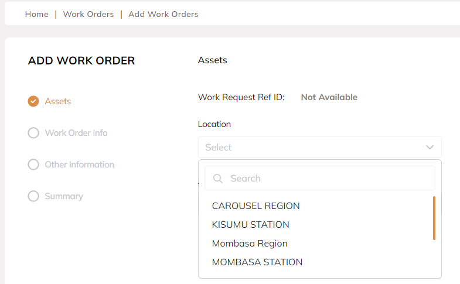
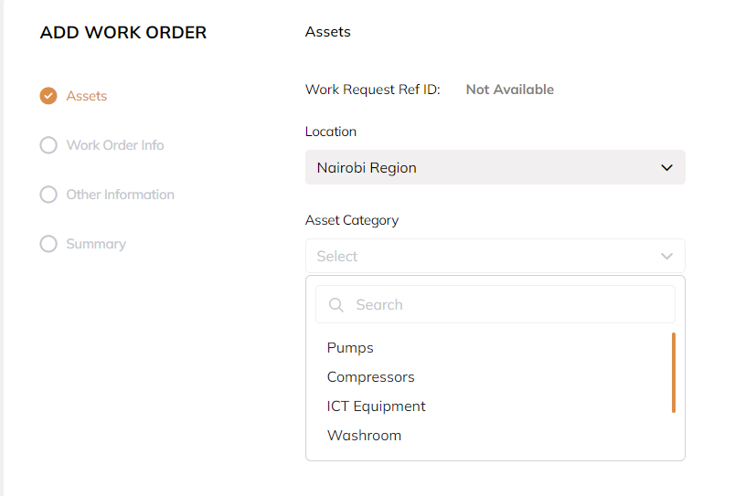
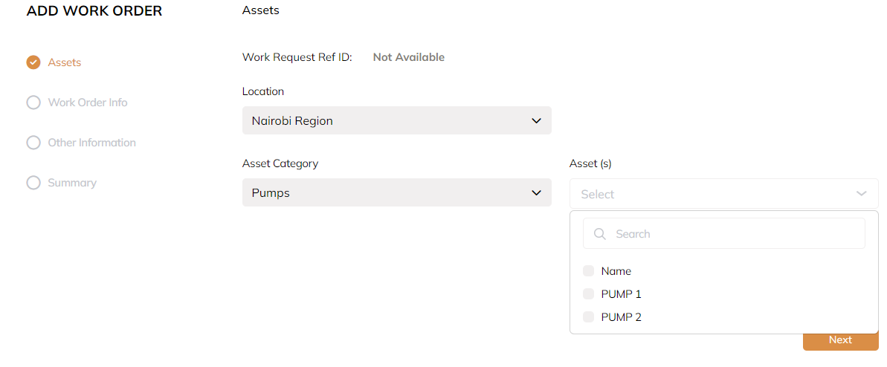
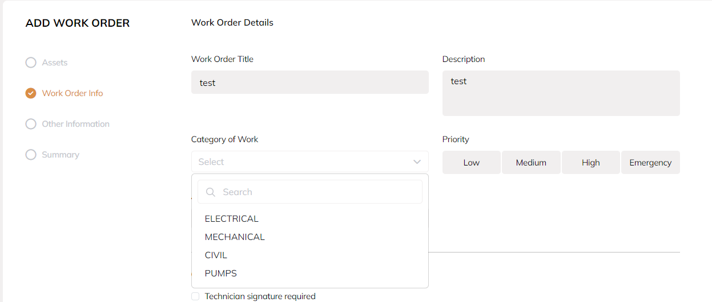
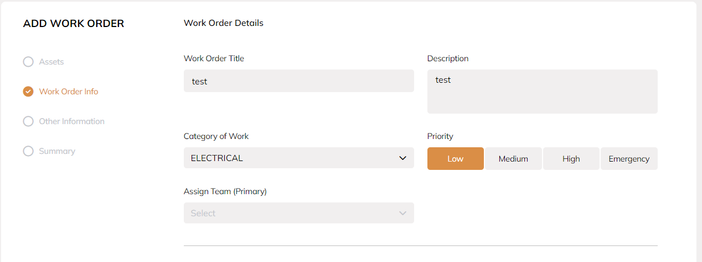
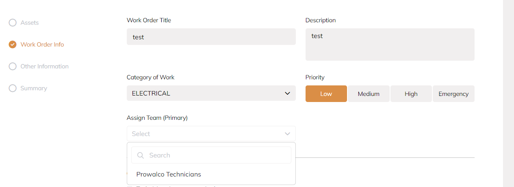
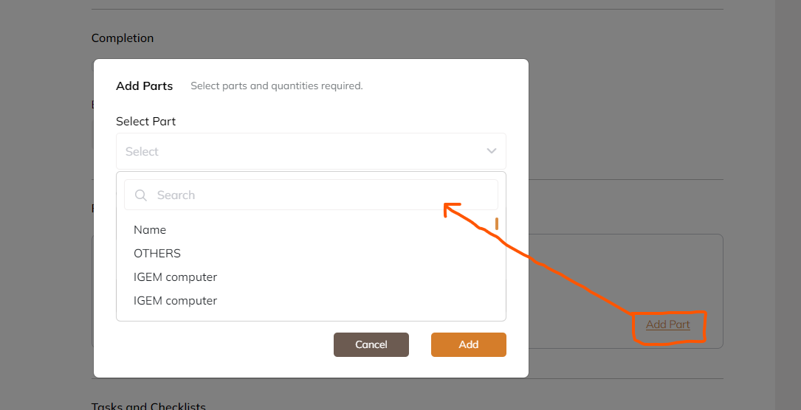
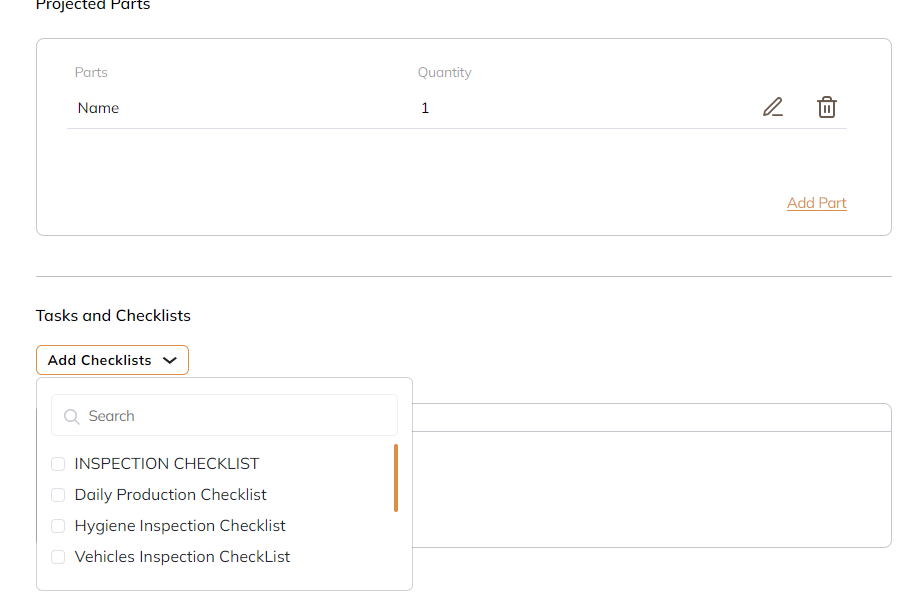

# Introduction to SaharaDesk

This is a simple project that will require you to create a new work order record 

# Requirements
- An editor prefarebly VsCode
- NodeJs atleast v16.14.0
- Git
- yarn

# Instructions

 ### Set up
  - Clone the project from [this will be provided during the interview]
  - Run `yarn install`
  - Run `yarn start`
  
 ### Login
  - To login use the following credentials
    `Username: mercymueni@tgdesk.com`
    `Password: T0vut!Gr0up`

 ### Defaults
  1.  Token
  Once a user is logged in, a token is generated which is stored in the local storage.
  The token will be used to send request to the backend.
  **Note:** token must be attached to the request for the request to be sent successfuly
  
  To get the token, use the following code of line: `localStorage.getItem("bearerToken")`

  2. Request ID  
  The Create work order request  requires paramater `requestId` this should always be `0`
  i.e `requestId: 0` 

  3.  Base64 Encoded file
  The Create work order request also requires a file e.g image to be uploaded. The file should be base64 encoded for it to work.

 ### Request Body
  Below is an example of how your request body should look like
  `{
    "locationId": 2,
    "categoryOfWorkId": 1,
    "assetListIds": [
      7
    ],
    "ticketTitle": "Test",
    "ticketDescription": "Test",
    "files": [
      {
      "encodedFile": "Base64 Encoded image",
      "fileName": "Logo.png",
      "url": "",
      "fileType": "png"
      }
    ],
    "checklistIds": [
      5
    ],
    "ticketPriorityId": 1,
    "assignedTeam": {
      "id": 1,
      "name": "EngineersAndAdmins"
    },
    "assignedUser": {
      "id": 6,
      "name": "Ouda"
    },
    "signatureRequiredToCompleteWork": true,
    "estimatedHours": 2,
    "projectedParts": [
      {
        "spareId": 1,
        "quantity": 10,
        "locationId": 10
      }
    ],
    "requestId": 0
  }`

 ### Request Endpoints
 **Note:** All the endpoints require token (`localStorage.getItem("bearerToken")`) to work
 
 **Main Endpoint**
 1. Create Work order [https://saharadeskbackend.azurewebsites.net/api/Tickets/RaiseTicket]
    This is the main endpoint that is called when you submit the form. 
    This is a `POST METHOD`
    ***Page Usage*** [http://localhost:3000/work-orders/add-work-order/summary]

 **Helper Endpoints**
 1. Get Locations [https://saharadeskbackend.azurewebsites.net/api/Locations/LocationsList]
    This is a `GET METHOD`
    ***Page Usage*** [http://localhost:3000/work-orders/add-work-order]
    
    
 2. Get Asset Category [https://saharadeskbackend.azurewebsites.net/api/Assets/Categories]
    This is a `GET METHOD`
    ***Page Usage*** [http://localhost:3000/work-orders/add-work-order]
    

 3. Get Assets [https://saharadeskbackend.azurewebsites.net/api/Assets/GetAssetsByLocationAndCategory/${locationId}/${AssetCategoryId}]
    This is a `GET METHOD`
    This endpoint depends on location and asset category endpoints.You will have to pass location Id and asset category Id
     ***Page Usage*** [http://localhost:3000/work-orders/add-work-order]
     

 4. Get Category of Works [https://saharadeskbackend.azurewebsites.net/api/CategoryOfWorks]
    This is a `GET METHOD`
    ***Page Usage*** [http://localhost:3000/work-orders/add-work-order/details]
    

 5. Get Priority [https://saharadeskbackend.azurewebsites.net/api/Tickets/GetAllTicketPriorities]
    This is a `GET METHOD`
     ***Page Usage*** [http://localhost:3000/work-orders/add-work-order/details]
     

 6. Get Teams (Assign Team (Primary)) [https://saharadeskbackend.azurewebsites.net/api/Team/GetTeamsToAssignTicket?locationId=${locationId}&categoryofworkId=${categoryofworkId}]
    This is a `GET METHOD`
    This endpoint depends on location and category of work endpoints.You will have to pass location Id and  category of work Id
    ***Page Usage*** [http://localhost:3000/work-orders/add-work-order/details]
    

 7. Get Assign Worker [https://saharadeskbackend.azurewebsites.net/api/Team/GetAllUsersByTeam/${teamId}]
    This is a `GET METHOD`
    This endpoint depends on get teams endpoints.You will have to pass team Id
    ***Page Usage*** [http://localhost:3000/work-orders/add-work-order/details]

 8. Get parts [https://saharadeskbackend.azurewebsites.net/api/Parts/GetAllParts]
    This is a `GET METHOD`
     ***Page Usage*** [http://localhost:3000/work-orders/add-work-order/details] **Add part Modal**
     

 9. Get Part Locations [https://saharadeskbackend.azurewebsites.net/api/Locations/LocationsList]
    This is a `GET METHOD`
    ***Page Usage*** [http://localhost:3000/work-orders/add-work-order/details] **Add part Modal**

  10. Get Checklist (Tasks and Checklist) [https://saharadeskbackend.azurewebsites.net/api/Checklists/GetChecklists?PageNumber=1&PageSize=100]
      This is a `GET METHOD`
    ***Page Usage*** [http://localhost:3000/work-orders/add-work-order/details]
    

